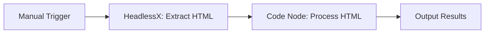
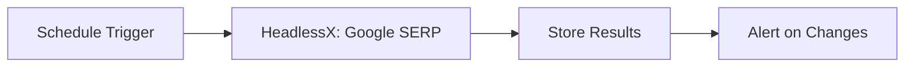
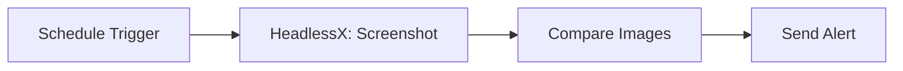

# n8n-nodes-headlessx

<div align="center">


**🚀 n8n community node for HeadlessX v2 - Anti-detection web scraping with Camoufox**

[](https://www.npmjs.com/package/n8n-nodes-headlessx)
[](https://www.npmjs.com/package/n8n-nodes-headlessx)
[](https://opensource.org/licenses/MIT)
[](https://github.com/SaifyXPRO/n8n-nodes-headlessx/stargazers)

[](https://docs.n8n.io/integrations/community-nodes/)
[](https://github.com/SaifyXPRO/n8n-nodes-headlessx)
[](https://www.typescriptlang.org/)
[](https://camoufox.com/)

[📚 Documentation](#-documentation) • [🚀 Quick Start](#-quick-start) • [✨ Features](#-whats-new-in-v20) • [📦 Installation](#-installation) • [🔧 Configuration](#-configuration)

</div>

---

## 🚀 About HeadlessX v2

**HeadlessX v2** is a next-generation stealth web scraping API powered by **Camoufox** - an undetectable browser that bypasses anti-bot systems.

### 🎯 Core Capabilities

<div align="center">

| Feature                  | Description                                | Use Cases                         |
| ------------------------ | ------------------------------------------ | --------------------------------- |
| 🦊 **Camoufox Engine**    | Undetectable Firefox-based browser         | Bot detection bypass              |
| 🔍 **Google SERP**        | Extract search results with anti-detection | SEO monitoring, search analysis   |
| 📄 **HTML Extraction**    | Fast raw HTML or JS-rendered content       | Web scraping, data mining         |
| 📝 **Content Extraction** | Clean Markdown from any page               | Content analysis, text processing |
| 📸 **Screenshots**        | High-quality page captures                 | Visual testing, documentation     |

</div>

> **⚠️ Important**: HeadlessX runs as a **separate API server**. This n8n node is a client that connects to your HeadlessX instance.
> 
> **🔗 Get HeadlessX**: [github.com/SaifyXPRO/HeadlessX](https://github.com/SaifyXPRO/HeadlessX)

## ✨ What's New in v2.0

<div align="center">

### 🚨 Major Version Update - Breaking Changes

</div>

| Change           | Before (v1.x)         | After (v2.0)                   |
| ---------------- | --------------------- | ------------------------------ |
| **API Paths**    | `/api/html`           | `/api/website/html`            |
| **Operations**   | 8 operations          | 5 streamlined operations       |
| **Methods**      | GET + POST duplicates | POST only (simplified)         |
| **New Features** | -                     | Google SERP, HTML-JS rendering |
| **Removed**      | PDF, Batch, Render    | Not in v2 API                  |

### 🔧 v2.0 Operations

<div align="center">

| Operation               | Endpoint                       | Description                      |
| ----------------------- | ------------------------------ | -------------------------------- |
| 📄 **Extract HTML**      | `POST /api/website/html`       | Fast raw HTML extraction         |
| 📄 **Extract HTML (JS)** | `POST /api/website/html-js`    | HTML with JavaScript rendering   |
| 📝 **Extract Content**   | `POST /api/website/content`    | Clean Markdown content           |
| 📸 **Screenshot**        | `POST /api/website/screenshot` | High-quality page captures       |
| 🔍 **Google SERP**       | `POST /api/google-serp/search` | Google search results extraction |

</div>

## 🚀 Quick Start

### 📋 Prerequisites

<div align="center">

| Requirement          | Version | Installation                                                           |
| -------------------- | ------- | ---------------------------------------------------------------------- |
| **HeadlessX Server** | v2.0+   | [Install Guide](https://github.com/SaifyXPRO/HeadlessX#installation)   |
| **n8n**              | 1.0.0+  | [n8n Documentation](https://docs.n8n.io/getting-started/installation/) |
| **Node.js**          | 18+     | [nodejs.org](https://nodejs.org/)                                      |

</div>

### ⚡ 30-Second Setup

1. **Install HeadlessX Server**:
   ```bash
   git clone https://github.com/SaifyXPRO/HeadlessX.git
   cd HeadlessX && pnpm install && pnpm dev
   ```

2. **Install n8n Community Node**:
   - Go to **Settings** → **Community Nodes** in n8n
   - Enter: `n8n-nodes-headlessx`
   - Click **Install**

3. **Configure Credentials**:
   - Create new **HeadlessX API** credential
   - Base URL: `http://localhost:3000`
   - API Token: Your token

4. **Test Connection**:
   - Add HeadlessX node to workflow
   - Select any operation and test

## 📦 Installation

### 🎯 Installation Options

<details>
<summary><strong>📱 Option 1: n8n Community Nodes (Recommended)</strong></summary>

1. Navigate to **Settings** → **Community Nodes** in your n8n instance
2. Click **Install a community node**
3. Enter package name: `n8n-nodes-headlessx`
4. Click **Install** and wait for completion
5. Restart n8n if required

</details>

<details>
<summary><strong>📦 Option 2: npm Installation</strong></summary>

```bash
# Global installation
npm install -g n8n-nodes-headlessx

# Local installation (for self-hosted n8n)
npm install n8n-nodes-headlessx
```

</details>

<details>
<summary><strong>🐳 Option 3: Docker Setup</strong></summary>

```dockerfile
FROM n8nio/n8n:latest
USER root
RUN npm install -g n8n-nodes-headlessx
USER node
```

**Docker Compose Example:**
```yaml
version: '3.8'
services:
  headlessx:
    build: ./HeadlessX
    ports: ["3000:3000"]
    environment:
      - DATABASE_URL=postgresql://...
    restart: unless-stopped

  n8n:
    image: n8nio/n8n:latest
    ports: ["5678:5678"]
    volumes: ["n8n_data:/home/node/.n8n"]
    depends_on: [headlessx]
    restart: unless-stopped

volumes:
  n8n_data:
```

</details>

## 🔧 Configuration

### 🔐 Setting Up Credentials

<div align="center">

| Field         | Description               | Example                 | Required |
| ------------- | ------------------------- | ----------------------- | -------- |
| **Base URL**  | HeadlessX server endpoint | `http://localhost:3000` | ✅        |
| **API Token** | Authentication token      | `your-secret-token`     | ✅        |

</div>

### 🔒 Authentication Methods

<div align="center">

| Method                    | Format                | Auto-Applied |
| ------------------------- | --------------------- | ------------ |
| **Query Parameter**       | `?token=your-token`   | ✅            |
| **Header Authentication** | `X-Token: your-token` | ✅            |

</div>

## 🎯 Available Operations

<div align="center">

### 📊 v2.0 Operations

</div>

<details>
<summary><strong>📄 Extract HTML</strong></summary>

**Endpoint:** `POST /api/website/html`

Extract raw HTML content from any webpage quickly without JavaScript rendering.

**Parameters:**
| Option         | Description          | Default  |
| -------------- | -------------------- | -------- |
| **URL**        | Target webpage URL   | Required |
| **Timeout**    | Request timeout (ms) | 30000    |
| **Wait Until** | Page load condition  | `load`   |
| **Headers**    | Custom HTTP headers  | -        |
| **User Agent** | Custom user agent    | -        |

**Use Cases:**
- Simple page scraping
- Static content extraction
- Fast bulk operations

</details>

<details>
<summary><strong>📄 Extract HTML (JS Rendered)</strong></summary>

**Endpoint:** `POST /api/website/html-js`

Extract HTML with full JavaScript rendering for SPAs and dynamic content.

**Parameters:**
| Option         | Description                     | Default        |
| -------------- | ------------------------------- | -------------- |
| **URL**        | Target webpage URL              | Required       |
| **Timeout**    | Request timeout (ms)            | 30000          |
| **Extra Wait** | Additional wait time after load | 0              |
| **Wait Until** | Page load condition             | `networkidle0` |

**Use Cases:**
- Single Page Applications (SPAs)
- React/Vue/Angular sites
- Dynamic content extraction

</details>

<details>
<summary><strong>📝 Extract Content</strong></summary>

**Endpoint:** `POST /api/website/content`

Extract clean, readable Markdown content from any webpage.

**Parameters:**
| Option         | Description          | Default  |
| -------------- | -------------------- | -------- |
| **URL**        | Target webpage URL   | Required |
| **Timeout**    | Request timeout (ms) | 30000    |
| **Wait Until** | Page load condition  | `load`   |

**Use Cases:**
- Article extraction
- Content analysis
- Text processing
- AI/LLM data preparation

</details>

<details>
<summary><strong>📸 Take Screenshot</strong></summary>

**Endpoint:** `POST /api/website/screenshot`

Capture high-quality screenshots of webpages.

**Parameters:**
| Option                | Description              | Default  |
| --------------------- | ------------------------ | -------- |
| **URL**               | Target webpage URL       | Required |
| **Full Page**         | Capture entire page      | true     |
| **Format**            | PNG, JPEG, WebP          | png      |
| **Quality**           | Image quality (1-100)    | 80       |
| **Wait for Selector** | CSS selector to wait for | -        |

**Use Cases:**
- Visual regression testing
- Website monitoring
- Documentation
- Social media content

</details>

<details>
<summary><strong>🔍 Google SERP Search</strong></summary>

**Endpoint:** `POST /api/google-serp/search`

Extract Google search results with advanced anti-detection.

**Parameters:**
| Option                | Description         | Default  |
| --------------------- | ------------------- | -------- |
| **Query**             | Search query        | Required |
| **Number of Results** | Results to return   | 10       |
| **Language**          | Search language     | en       |
| **Country**           | Result localization | us       |
| **Safe Search**       | Safety filter level | off      |

**Use Cases:**
- SEO monitoring
- Competitor analysis
- Keyword research
- Search result tracking

</details>

## 💡 Example Workflows

### 🚀 Quick Start Examples

<details>
<summary><strong>1. 🕷️ Simple Web Scraping</strong></summary>



**Configuration:**
```json
{
  "operation": "html",
  "url": "https://example.com",
  "htmlOptions": {
    "timeout": 30000,
    "waitUntil": "networkidle2"
  }
}
```

</details>

<details>
<summary><strong>2. 🔍 Google SERP Monitoring</strong></summary>



**Configuration:**
```json
{
  "operation": "googleSerp",
  "query": "your keyword",
  "serpOptions": {
    "num": 20,
    "hl": "en",
    "gl": "us"
  }
}
```

</details>

<details>
<summary><strong>3. 📸 Website Monitoring</strong></summary>



**Configuration:**
```json
{
  "operation": "screenshot",
  "url": "https://your-website.com",
  "screenshotOptions": {
    "fullPage": true,
    "format": "png"
  }
}
```

</details>

## 🚨 Troubleshooting

### 🔍 Common Issues & Solutions

<details>
<summary><strong>❌ Connection Issues</strong></summary>

**"Couldn't connect with these settings"**

| Check              | Solution                                |
| ------------------ | --------------------------------------- |
| **Server Running** | `curl http://localhost:3000/api/health` |
| **URL Format**     | Use `http://localhost:3000` (no `/api`) |
| **Network Access** | Check firewall/Docker networking        |
| **Token Validity** | Verify API token is correct             |

</details>

<details>
<summary><strong>⏱️ Timeout Issues</strong></summary>

**"Request timeout" errors**

| Cause               | Solution                                |
| ------------------- | --------------------------------------- |
| **Slow Page Load**  | Increase timeout to 60000ms+            |
| **Dynamic Content** | Use `htmlJs` operation with `extraWait` |
| **Heavy Resources** | Use `domcontentloaded` wait condition   |

</details>

## 🤝 Contributing

We welcome contributions! See [CONTRIBUTING.md](CONTRIBUTING.md) for guidelines.

## 📄 License

MIT License - see [LICENSE](LICENSE) for details.

---

<div align="center">

**Made with ❤️ by [SaifyXPRO](https://github.com/SaifyXPRO)**

[](https://github.com/SaifyXPRO/n8n-nodes-headlessx)
[](https://www.npmjs.com/package/n8n-nodes-headlessx)

</div>
