# n8n-nodes-headlessx

<div align="center">


**🚀 A powerful n8n community node for HeadlessX - Advanced web scraping, screenshots, and PDF generation**

[](https://www.npmjs.com/package/n8n-nodes-headlessx)
[](https://www.npmjs.com/package/n8n-nodes-headlessx)
[](https://opensource.org/licenses/MIT)
[](https://github.com/SaifyXPRO/n8n-nodes-headlessx/stargazers)

[](https://docs.n8n.io/integrations/community-nodes/)
[](https://github.com/SaifyXPRO/n8n-nodes-headlessx)
[](https://www.typescriptlang.org/)
[](https://pptr.dev/)

[](https://github.com/SaifyXPRO/n8n-nodes-headlessx/actions)
[](https://github.com/SaifyXPRO/n8n-nodes-headlessx/releases)
[](https://github.com/SaifyXPRO/n8n-nodes-headlessx/commits/master)

[📚 Documentation](#-documentation) • [🚀 Quick Start](#-quick-start) • [✨ Features](#-whats-new-in-v121) • [📦 Installation](#-installation) • [🔧 Configuration](#-configuration) • [💡 Examples](#-example-workflows) • [🆘 Support](#-support)

</div>

---

## 🚀 About HeadlessX

**HeadlessX** is a cutting-edge headless browser API built with modern web technologies that revolutionizes web automation and data extraction.

### 🎯 Core Capabilities

<div align="center">

| Feature | Description | Use Cases |
|---------|-------------|-----------|
| 🕷️ **Web Scraping** | Extract HTML content and clean text from any webpage | Data mining, content analysis, price monitoring |
| 📸 **Screenshot Capture** | High-quality images in PNG, JPEG, WebP formats | Visual testing, documentation, social media |
| 📄 **PDF Generation** | Convert web pages to professional PDF documents | Reports, invoices, documentation archival |
| 🔄 **Batch Processing** | Handle multiple URLs concurrently for improved performance | Bulk operations, data collection, monitoring |
| 🎭 **Dynamic Content** | Execute custom JavaScript and handle SPAs | Modern web apps, complex interactions |
| 🤖 **Human-like Behavior** | Simulate real user interactions to bypass detection | Reliable scraping, anti-bot circumvention |

</div>

> **⚠️ Important**: HeadlessX runs as a **separate API server** that you must install and run independently. This n8n node acts as a client to communicate with your HeadlessX server instance.
> 
> **🔗 Get HeadlessX**: [github.com/SaifyXPRO/HeadlessX](https://github.com/SaifyXPRO/HeadlessX)

## ✨ What's New in v1.2.1

<div align="center">

### 🚨 Critical Production Fixes

</div>

| Issue | Solution | Impact |
|-------|----------|--------|
| **"stream.on is not a function" Error** | Fixed `prepareBinaryData()` calls to use proper Buffer objects | ✅ Preview functionality now works in all n8n environments |
| **Binary Data Handling** | Enhanced with comprehensive Buffer-based operations | ✅ Stable binary downloads for screenshots and PDFs |
| **Error Recovery** | Added try-catch blocks with JSON fallbacks | ✅ Nodes continue working even if preview fails |
| **Production Stability** | Enhanced error handling and validation | ✅ Enterprise-ready reliability |

### 🔧 Technical Improvements

<div align="center">

| Component | Enhancement | Benefit |
|-----------|-------------|---------|
| **BinaryDataHelper Utility** | New comprehensive utility class | Future-proof binary operations |
| **Environment Validation** | n8n runtime compatibility checks | Seamless deployment across versions |
| **Buffer-Based Operations** | All binary data uses proper Buffer objects | Enhanced stability and performance |
| **TypeScript Enhancements** | Clean compilation with enhanced type safety | Better developer experience |

</div>

### 🛡️ Enhanced Reliability

- **Graceful Degradation**: Preview operations fallback to JSON output if binary preparation fails
- **Future-Proof Architecture**: BinaryDataHelper provides foundation for future binary operations  
- **Production Ready**: Tested and validated for n8n production environments
- **Error Transparency**: Comprehensive logging and error reporting

> **🎯 Upgrade Impact**: v1.2.1 resolves all known production issues while maintaining full backward compatibility

## � Quick Start

### 📋 Prerequisites

<div align="center">

| Requirement | Version | Installation |
|-------------|---------|--------------|
| **HeadlessX Server** | Latest | [Install Guide](https://github.com/SaifyXPRO/HeadlessX#installation) |
| **n8n** | 1.0.0+ | [n8n Documentation](https://docs.n8n.io/getting-started/installation/) |
| **Node.js** | 18+ | [nodejs.org](https://nodejs.org/) |

</div>

### ⚡ 30-Second Setup

1. **Install HeadlessX Server**:
   ```bash
   git clone https://github.com/SaifyXPRO/HeadlessX.git
   cd HeadlessX && npm install && npm start
   ```

2. **Install n8n Community Node**:
   - Go to **Settings** → **Community Nodes** in n8n
   - Enter: `n8n-nodes-headlessx`
   - Click **Install**

3. **Configure Credentials**:
   - Create new **HeadlessX API** credential
   - Base URL: `http://localhost:3000`
   - API Token: Your token

4. **Test Connection**:
   - Add HeadlessX node to workflow
   - Select "Health Check" operation
   - Execute to verify connection

> **🚨 Critical**: This n8n community node is a **client** that connects to the HeadlessX API server. The HeadlessX server must be running and accessible before you can use this node.

## 📦 Installation

### 🎯 Installation Options

<details>
<summary><strong>📱 Option 1: n8n Community Nodes (Recommended)</strong></summary>

1. Navigate to **Settings** → **Community Nodes** in your n8n instance
2. Click **Install a community node**
3. Enter package name: `n8n-nodes-headlessx`
4. Click **Install** and wait for completion
5. Restart n8n if required

</details>

<details>
<summary><strong>📦 Option 2: npm Installation</strong></summary>

```bash
# Global installation
npm install -g n8n-nodes-headlessx

# Local installation (for self-hosted n8n)
npm install n8n-nodes-headlessx
```

</details>

<details>
<summary><strong>🐳 Option 3: Docker Setup</strong></summary>

```dockerfile
FROM n8nio/n8n:latest
USER root
RUN npm install -g n8n-nodes-headlessx
USER node
```

**Docker Compose Example:**
```yaml
version: '3.8'
services:
  headlessx:
    image: saifyxpro/headlessx:latest
    ports: ["3000:3000"]
    environment:
      - API_TOKEN=your-secret-token
    restart: unless-stopped

  n8n:
    image: n8nio/n8n:latest
    ports: ["5678:5678"]
    volumes: ["n8n_data:/home/node/.n8n"]
    environment:
      - N8N_BASIC_AUTH_ACTIVE=true
      - N8N_BASIC_AUTH_USER=admin
      - N8N_BASIC_AUTH_PASSWORD=password
    depends_on: [headlessx]
    restart: unless-stopped

volumes:
  n8n_data:
```

</details>

<details>
<summary><strong>🔧 Option 4: Manual Installation</strong></summary>

```bash
# Create custom nodes directory
mkdir -p ~/.n8n/custom/
# Clone and copy package
git clone https://github.com/SaifyXPRO/n8n-nodes-headlessx.git
cp -r n8n-nodes-headlessx ~/.n8n/custom/
```

**Windows (PowerShell):**
```powershell
New-Item -ItemType Directory -Force -Path "$HOME/.n8n/custom"
Copy-Item -Recurse .\n8n-nodes-headlessx "$HOME/.n8n/custom/"
```

</details>

## 🔧 Configuration

### 🔐 Setting Up Credentials

<div align="center">

| Field | Description | Example | Required |
|-------|-------------|---------|----------|
| **Base URL** | HeadlessX server endpoint (without /api) | `http://localhost:3000` | ✅ |
| **API Token** | Authentication token | `your-secret-token` | ✅ |

</div>

### 🚀 Configuration Steps

1. **Create Credential**:
   - In n8n workflow, add HeadlessX node
   - Click "Create New Credential"
   - Select "HeadlessX API"

2. **Configure Settings**:
   ```json
   {
     "baseUrl": "http://localhost:3000",
     "apiToken": "your-secret-token"
   }
   ```

3. **Test Connection**:
   - Automatic health check to `/api/health`
   - Validates authentication
   - Verifies server response format

### 🔒 Authentication Methods

<div align="center">

| Method | Format | Auto-Applied |
|--------|--------|--------------|
| **Query Parameter** | `?token=your-token` | ✅ |
| **Header Authentication** | `X-Token: your-token` | ✅ |

</div>

### ✅ Verification Checklist

- [ ] HeadlessX server running: `curl http://localhost:3000/api/health`
- [ ] Returns: `{"status":"ok","uptime":"..."}`
- [ ] n8n node credential test passes
- [ ] Network connectivity confirmed
- [ ] API token validated

## 🎯 Available Operations

<div align="center">

### 📊 Operation Categories

</div>

<details>
<summary><strong>🔍 Content Extraction Operations</strong></summary>

| Operation | Method | Purpose | Best For |
|-----------|--------|---------|----------|
| **📄 Extract HTML (GET)** | `GET /api/html` | Quick HTML extraction | Simple scraping, fast extraction |
| **📄 Extract HTML (POST)** | `POST /api/html` | Advanced HTML extraction | Complex scenarios, detailed control |
| **📝 Extract Text (GET)** | `GET /api/content` | Clean text extraction | Content analysis, text processing |
| **📝 Extract Text (POST)** | `POST /api/content` | Advanced text processing | Data mining, complex rules |

**Common Parameters:**
- URL, timeout, wait conditions, viewport settings
- Custom headers, cookies, user agent
- Element selectors, scroll behavior

</details>

<details>
<summary><strong>📸 Visual Capture Operations</strong></summary>

| Operation | Endpoint | Formats | Features |
|-----------|----------|---------|----------|
| **📸 Take Screenshot** | `GET /api/screenshot` | PNG, JPEG, WebP | Device emulation, custom dimensions, quality control |
| **📋 Generate PDF** | `GET /api/pdf` | PDF | A4/A3/Letter formats, margins, headers/footers |

**Screenshot Options:**
- **Dimensions**: Custom width/height or device presets
- **Quality**: JPEG quality (1-100), WebP compression
- **Capture**: Full page or viewport only
- **Device Emulation**: Mobile/tablet simulation

**PDF Options:**
- **Formats**: A4, A3, A5, Letter, Legal, Tabloid
- **Orientation**: Portrait or Landscape  
- **Margins**: Custom page margins
- **Features**: Background graphics, scale factor

</details>

<details>
<summary><strong>⚡ Advanced Processing Operations</strong></summary>

| Operation | Method | Purpose | Use Cases |
|-----------|--------|---------|-----------|
| **🎭 Custom Render** | `POST /api/render` | JavaScript execution | Dynamic content, custom data extraction |
| **🔄 Batch Processing** | `POST /api/batch` | Multiple URLs | Bulk operations, performance optimization |
| **🩺 Health Check** | `GET /api/health` | Server monitoring | Connection validation, system health |
| **📊 Server Status** | `GET /api/status` | Detailed metrics | Performance monitoring, debugging |

**Advanced Features:**
- Custom script execution
- Concurrent processing (configurable)
- Real-time performance metrics
- Resource usage monitoring

</details>

## 🎨 Visual Interface & Enhanced UX

### 🎯 Modern Operation Selection (v1.2.1)

<div align="center">

The n8n-nodes-headlessx v1.2.1 features **critical production fixes** with enhanced binary data handling, robust error recovery, and improved stability for enterprise n8n environments.


</div>

### 📊 Enhanced Operation Categories

<div align="center">

| Category | Operations | Description |
|----------|------------|-------------|
| **🔍 Content Extraction** | 📄 HTML GET/POST<br>📝 Content GET/POST | Raw HTML scraping and clean text extraction |
| **📸 Visual Capture** | 📸 Screenshots<br>📋 PDF Generation | High-quality captures and document creation |
| **⚡ Advanced Processing** | 🎭 Custom Render<br>🔄 Batch Processing | Dynamic content and bulk operations |

</div>

### �️ Visual Previews

<details>
<summary><strong>📸 View Operation Screenshots</strong></summary>

#### Credential Configuration
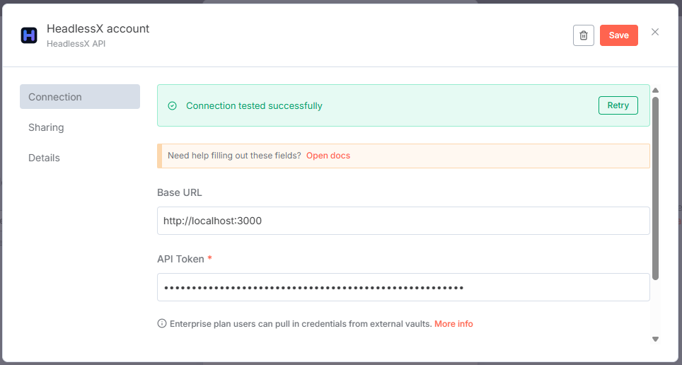
*✅ Successful HeadlessX API credential configuration*

#### HTML Extraction Operations
| GET Method | POST Method |
|------------|-------------|
| 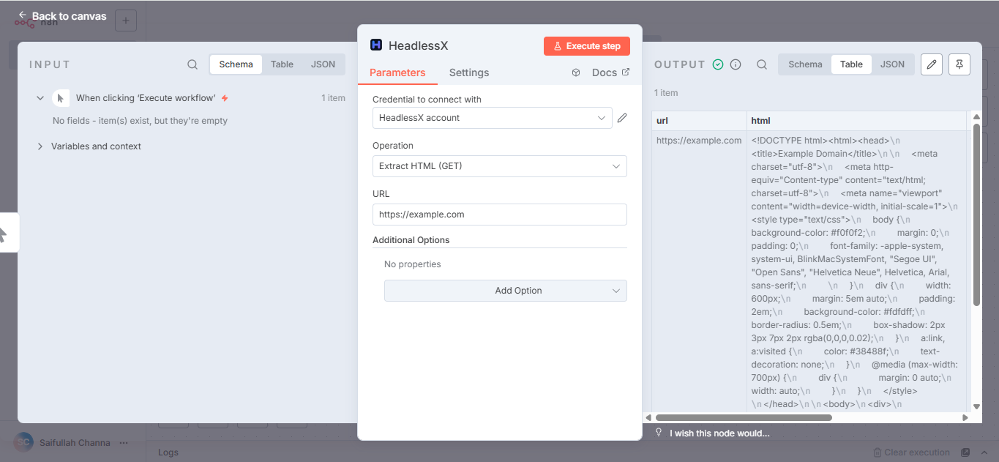 | 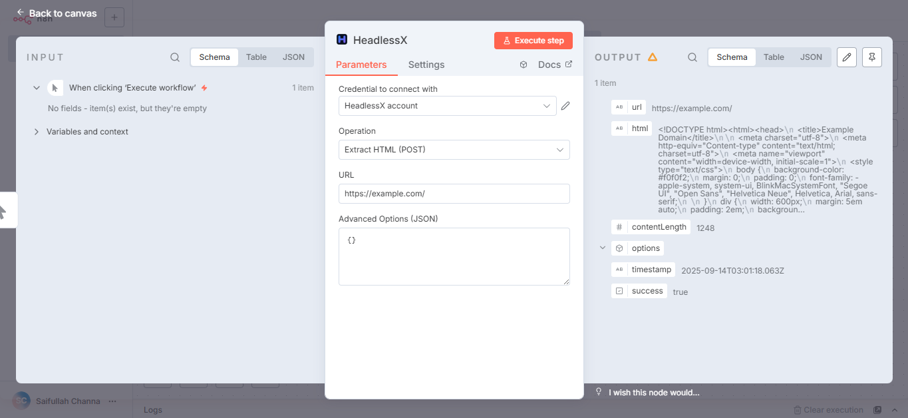 |
| *Simple HTML extraction* | *Advanced HTML extraction with full options* |

#### Content & Visual Operations
| Text Extraction | Screenshot Capture |
|-----------------|-------------------|
| 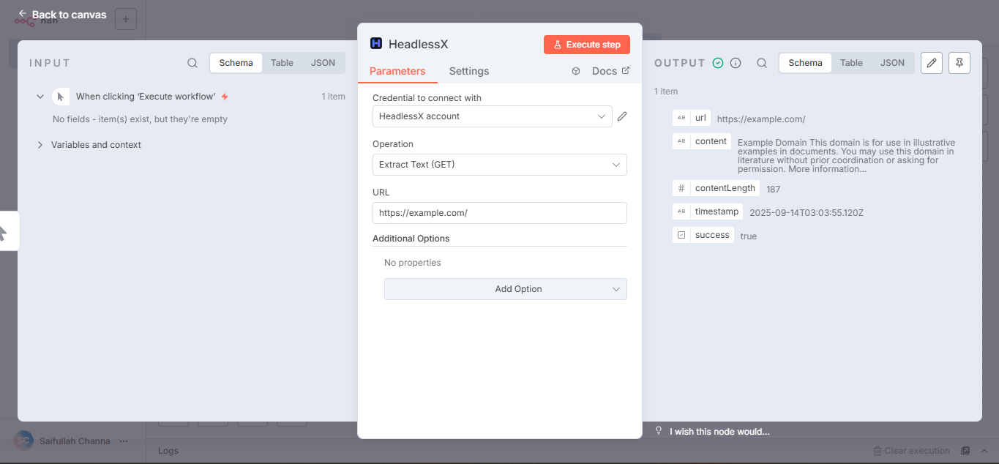 | 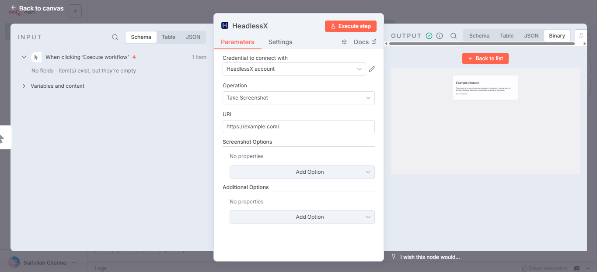 |
| *Clean text content extraction* | *High-quality screenshot with device emulation* |

#### Document Generation & Advanced Processing
| PDF Generation | Custom Rendering |
|----------------|------------------|
| 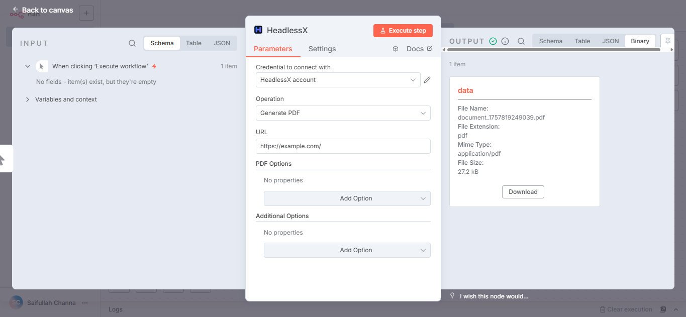 | 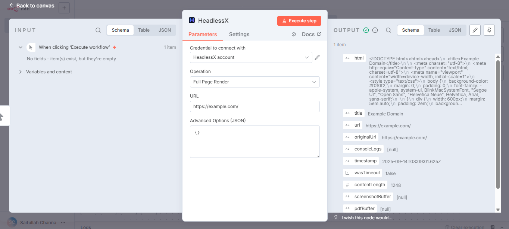 |
| *Professional PDF documents* | *Advanced custom script execution* |

</details>

### 🎯 Enhanced Features (v1.2.1)

<div align="center">

### ✨ User Experience Enhancements

| Feature | Description | Benefit |
|---------|-------------|---------|
| **📱 Visual Operation Icons** | Intuitive emoji icons for operation recognition | Faster workflow creation |
| **🏷️ Smart Categories** | Logical grouping by functionality | Better organization |
| **💡 Enhanced Descriptions** | Detailed tooltips and action descriptions | Clear understanding |
| **🎯 Intelligent Defaults** | Pre-selected common operations | Streamlined setup |

### 🔧 Advanced Control Options

| Feature | Scope | Capabilities |
|---------|--------|-------------|
| **⚙️ Comprehensive POST Controls** | All operations | Advanced configuration collections |
| **� Device Emulation Presets** | Screenshots | Desktop, Mobile, Tablet presets |
| **🎨 Format & Quality Options** | Visual captures | PNG/JPEG/WebP with quality controls |
| **⚡ Performance Tuning** | All operations | Timeout, concurrency, error handling |

### 🛡️ Reliability Features

| Feature | Implementation | Impact |
|---------|---------------|--------|
| **✅ Real-time Validation** | URL & input validation | Immediate feedback |
| **📝 JSON Editor** | Batch URL configuration | Enhanced usability |
| **🔄 Error Recovery** | Context-aware error messages | Better debugging |
| **📋 Organized Properties** | Alphabetical ordering | Easier navigation |

</div>

## � Example Workflows

### 🚀 Quick Start Examples

<details>
<summary><strong>1. 🕷️ Simple Web Scraping</strong></summary>

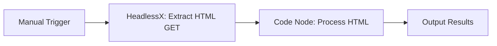

**Configuration:**
```json
{
  "operation": "htmlGet",
  "url": "https://example.com",
  "timeout": 30000,
  "waitUntil": "networkidle2"
}
```

**Code Node Example:**
```javascript
// Extract title and meta description
const html = $input.first().json.data;
const titleMatch = html.match(/<title>(.*?)<\/title>/i);
const descMatch = html.match(/<meta name="description" content="(.*?)"/i);

return [{
  title: titleMatch ? titleMatch[1] : 'No title',
  description: descMatch ? descMatch[1] : 'No description',
  url: $input.first().json.url
}];
```

</details>

<details>
<summary><strong>2. 📸 Automated Website Monitoring</strong></summary>

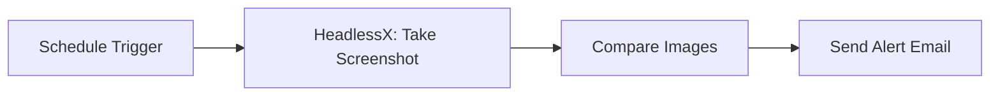

**Configuration:**
```json
{
  "operation": "screenshot",
  "url": "https://your-website.com",
  "format": "PNG",
  "fullPage": true,
  "width": 1920,
  "height": 1080
}
```

**Use Cases:**
- Visual regression testing
- Website uptime monitoring  
- Competitive analysis
- Social media content

</details>

<details>
<summary><strong>3. 🔄 Bulk Data Processing</strong></summary>

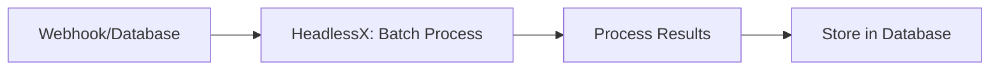

**Configuration:**
```json
{
  "operation": "batch",
  "urls": ["https://site1.com", "https://site2.com", "https://site3.com"],
  "concurrent": 3,
  "operation_type": "content",
  "timeout": 30000
}
```

**Benefits:**
- Parallel processing
- Resource optimization
- Error handling per URL
- Progress tracking

</details>

<details>
<summary><strong>4. 📋 Report Generation</strong></summary>

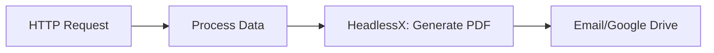

**Configuration:**
```json
{
  "operation": "pdf",
  "url": "https://report-generator.com/report?data={{$json}}",
  "format": "A4",
  "orientation": "portrait",
  "margins": {
    "top": "1cm",
    "right": "1cm", 
    "bottom": "1cm",
    "left": "1cm"
  }
}
```

**Applications:**
- Financial reports
- Invoice generation
- Documentation archival
- Custom dashboards

</details>

<details>
<summary><strong>5. 🎭 Dynamic Content Extraction</strong></summary>

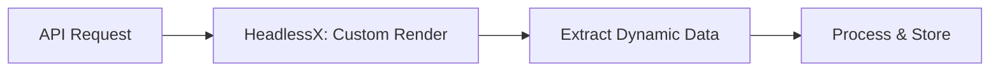

**Configuration:**
```json
{
  "operation": "render",
  "url": "https://spa-application.com",
  "waitForSelectors": [".dynamic-content", ".data-loaded"],
  "extraWait": 3000,
  "customScript": "document.querySelector('.load-more').click(); await new Promise(r => setTimeout(r, 2000));"
}
```

**Advanced Features:**
- SPA interaction
- Custom JavaScript execution
- Dynamic waiting conditions
- Complex data extraction

</details>

## 🛠️ Advanced Configuration

### ⚙️ Configuration Options Reference

<details>
<summary><strong>🔧 Basic Options (All Operations)</strong></summary>

| Option | Values | Default | Description |
|--------|--------|---------|-------------|
| **Timeout** | 1000-300000ms | 30000 | Navigation timeout |
| **Wait Until** | `load`, `domcontentloaded`, `networkidle0`, `networkidle2` | `load` | Page load completion |
| **Extra Wait** | 0-30000ms | 0 | Additional wait after load |
| **Scroll** | `true`, `false` | `false` | Auto-scroll to trigger lazy loading |

</details>

<details>
<summary><strong>🎯 Advanced Options</strong></summary>

| Feature | Purpose | Configuration |
|---------|---------|---------------|
| **Wait for Selectors** | Element visibility | CSS selectors array |
| **Click Selectors** | Auto-interactions | CSS selectors to click |
| **Remove Elements** | Clean content | Elements to remove (ads, modals) |
| **Custom Headers** | Authentication | Key-value pairs |
| **Cookies** | Session management | Cookie objects |
| **User Agent** | Device simulation | Custom user agent string |
| **Viewport** | Screen dimensions | Width × height pixels |

</details>

<details>
<summary><strong>📸 Visual Capture Options</strong></summary>

**Screenshot Settings:**
| Option | Values | Recommendation |
|--------|--------|----------------|
| **Format** | PNG, JPEG, WebP | PNG for quality, WebP for size |
| **Quality** | 1-100 | 80 for balanced size/quality |
| **Full Page** | true/false | true for documentation |
| **Dimensions** | Custom W×H | 1920×1080 for desktop |

**PDF Settings:**
| Option | Values | Use Case |
|--------|--------|----------|
| **Format** | A4, A3, Letter, Legal | A4 for reports |
| **Orientation** | Portrait, Landscape | Portrait for documents |
| **Margins** | Custom cm/in | 1cm for professional look |
| **Background** | true/false | true for branded documents |

</details>

### 🐳 Production Deployment

<details>
<summary><strong>📦 Docker Production Setup</strong></summary>

```yaml
version: '3.8'
services:
  headlessx:
    image: saifyxpro/headlessx:latest
    restart: unless-stopped
    ports: ["3000:3000"]
    environment:
      - API_TOKEN=${HEADLESSX_TOKEN}
      - TIMEOUT_DEFAULT=30000
      - CONCURRENCY_LIMIT=10
      - MAX_MEMORY_USAGE=2048
    healthcheck:
      test: ["CMD", "curl", "-f", "http://localhost:3000/api/health"]
      interval: 30s
      timeout: 10s
      retries: 3

  n8n:
    image: n8nio/n8n:latest
    restart: unless-stopped
    ports: ["5678:5678"]
    environment:
      - N8N_HOST=${N8N_HOST}
      - N8N_PORT=5678
      - N8N_PROTOCOL=https
      - NODE_ENV=production
      - WEBHOOK_URL=${N8N_WEBHOOK_URL}
    volumes:
      - n8n_data:/home/node/.n8n
    depends_on:
      headlessx:
        condition: service_healthy

volumes:
  n8n_data:
```

</details>

### ⚡ Performance Optimization

<div align="center">

| Optimization | Implementation | Performance Gain |
|--------------|---------------|------------------|
| **Use GET for Simple Tasks** | Prefer GET over POST | 20-30% faster |
| **Batch Processing** | Multiple URLs together | 60-80% efficiency |
| **Optimize Wait Conditions** | `domcontentloaded` vs `load` | 40-50% faster |
| **Image Format Selection** | WebP > JPEG > PNG | 50-70% smaller files |
| **Concurrent Limits** | 3-5 concurrent requests | Optimal resource usage |

</div>

## 🚨 Troubleshooting

### 🔍 Common Issues & Solutions

<details>
<summary><strong>❌ Connection Issues</strong></summary>

**"Couldn't connect with these settings"**

| Check | Solution |
|-------|----------|
| **Server Running** | `curl http://localhost:3000/api/health` |
| **URL Format** | Use `http://localhost:3000` (no `/api`) |
| **Network Access** | Check firewall/Docker networking |
| **Token Validity** | Verify API token is correct |

</details>

<details>
<summary><strong>⏱️ Timeout Issues</strong></summary>

**"Request timeout" errors**

| Cause | Solution |
|-------|----------|
| **Slow Page Load** | Increase timeout to 60000ms+ |
| **Heavy Resources** | Use `domcontentloaded` wait condition |
| **Dynamic Content** | Add `extraWait` 2000-5000ms |
| **Network Issues** | Check target website performance |

</details>

<details>
<summary><strong>🔄 Dynamic Content Issues</strong></summary>

**"Element not found" or missing content**

| Problem | Fix |
|---------|-----|
| **SPA Loading** | Add `waitForSelectors` for key elements |
| **Lazy Loading** | Enable `scroll: true` option |
| **AJAX Requests** | Use `networkidle0` wait condition |
| **Timing Issues** | Increase `extraWait` to 3000-5000ms |

</details>

<details>
<summary><strong>💾 Binary Data Issues</strong></summary>

**v1.2.1 Fixed:** "stream.on is not a function" errors

| Issue | v1.2.1 Solution |
|-------|----------------|
| **Preview Failures** | Enhanced Buffer-based binary handling |
| **Large Files** | Graceful degradation to JSON output |
| **Memory Issues** | Optimized binary data processing |
| **n8n Compatibility** | Full n8n runtime environment validation |

</details>

## 📊 Performance Benchmarks

<div align="center">

### ⚡ Response Time Benchmarks

| Operation | Typical Range | Memory Usage | Optimization Tips |
|-----------|---------------|--------------|-------------------|
| **Health Check** | 10-50ms | Very Low | Use for monitoring |
| **HTML GET** | 100-2000ms | Low-Medium | Fast for simple sites |
| **HTML POST** | 200-3000ms | Medium | Better for complex sites |
| **Screenshot** | 500-5000ms | Medium-High | Optimize dimensions |
| **PDF Generation** | 1000-8000ms | High | Use for final documents |
| **Batch (5 URLs)** | 1000-10000ms | High | Best for bulk operations |

*Performance varies based on target website complexity and server resources*

### 🎯 Optimization Guidelines

| Scenario | Recommended Settings | Expected Performance |
|----------|---------------------|---------------------|
| **Simple Scraping** | GET method, `domcontentloaded` | Sub-second response |
| **Complex Sites** | POST method, `networkidle2`, extraWait | 2-5 second response |
| **Visual Testing** | PNG format, full page capture | 3-8 second response |
| **Bulk Processing** | Batch operation, 3-5 concurrent | Linear scaling |

</div>

## 🤝 Contributing

<div align="center">

We welcome contributions from the community! Help make HeadlessX better for everyone.

[](https://github.com/SaifyXPRO/n8n-nodes-headlessx/graphs/contributors)
[](https://github.com/SaifyXPRO/n8n-nodes-headlessx/issues)
[](https://github.com/SaifyXPRO/n8n-nodes-headlessx/pulls)

</div>

### 🚀 Development Setup

```bash
# 1. Clone the repository
git clone https://github.com/SaifyXPRO/n8n-nodes-headlessx.git
cd n8n-nodes-headlessx

# 2. Install dependencies
npm install

# 3. Build the project
npm run build

# 4. Run tests
npm test

# 5. Lint and format code
npm run lint
npm run format
```

### 📝 Contribution Guidelines

| Type | Process | Requirements |
|------|---------|--------------|
| **🐛 Bug Reports** | [Create Issue](https://github.com/SaifyXPRO/n8n-nodes-headlessx/issues/new) | Reproduction steps, environment details |
| **✨ Feature Requests** | [Create Issue](https://github.com/SaifyXPRO/n8n-nodes-headlessx/issues/new) | Use case description, implementation ideas |
| **🔧 Code Contributions** | Fork → Branch → PR | Tests, documentation, code review |
| **📚 Documentation** | Direct PR | Clear, accurate, helpful content |

## 📄 License

<div align="center">

This project is licensed under the **MIT License** - see the [LICENSE.md](LICENSE.md) file for details.

[](https://opensource.org/licenses/MIT)

**Free to use, modify, and distribute** ✨

</div>

## 🆘 Support

<div align="center">

### 💬 Get Help & Stay Connected

</div>

| Resource | Purpose | Link |
|----------|---------|------|
| **📖 Documentation** | Complete API reference | [HeadlessX Docs](https://github.com/SaifyXPRO/HeadlessX#readme) |
| **🐛 Issues & Bugs** | Report problems | [GitHub Issues](https://github.com/SaifyXPRO/n8n-nodes-headlessx/issues) |
| **💡 Feature Requests** | Suggest improvements | [GitHub Discussions](https://github.com/SaifyXPRO/n8n-nodes-headlessx/discussions) |
| **🔧 n8n Community** | General n8n support | [n8n Community Forum](https://community.n8n.io/) |
| **📺 Video Tutorials** | Visual learning | [YouTube Channel](https://youtube.com/@saifyxpro) |

### 🏷️ Version History

<details>
<summary><strong>📋 Release Timeline</strong></summary>

| Version | Date | Highlights |
|---------|------|------------|
| **v1.2.1** | 2025-09-14 | 📦 Package version maintenance and verification readiness |
| **v1.2.0** | 2025-09-14 | 🚨 Critical production fixes, enhanced binary data handling |
| **v1.1.3** | 2025-09-13 | ✨ Enhanced UX with visual operation categories, emoji icons |
| **v1.1.2** | 2025-09-XX | 🔧 Improved setup documentation, duplicate field fixes |
| **v1.0.9** | 2024-12-XX | 🐛 Fixed node execution issues, proper n8n output formatting |
| **v1.0.0** | 2024-XX-XX | 🎉 Initial release with full HeadlessX API integration |

</details>

## 🙏 Acknowledgments

<div align="center">

### 💝 Special Thanks

</div>

| Project | Contribution | Impact |
|---------|-------------|--------|
| **[n8n](https://n8n.io/)** | Powerful workflow automation platform | Foundation for community nodes |
| **[HeadlessX](https://github.com/SaifyXPRO/HeadlessX)** | Robust headless browser API | Core functionality provider |
| **[Puppeteer](https://pptr.dev/)** | Headless Chrome API | Browser automation engine |
| **[TypeScript](https://typescriptlang.org/)** | Type-safe JavaScript | Development framework |

### 🌟 Community

<div align="center">

**Made with ❤️ by [SaifyXPRO](https://github.com/SaifyXPRO) and the community**

[](https://github.com/SaifyXPRO)
[](https://twitter.com/SaifyXPRO)

</div>

---

<div align="center">

### ⭐ If this node helps your workflow, please consider giving it a star on GitHub!

[](https://github.com/SaifyXPRO/n8n-nodes-headlessx)

**[⬆️ Back to Top](#n8n-nodes-headlessx)**

</div>
